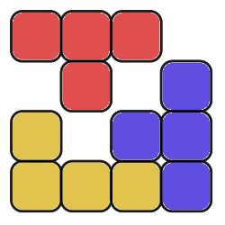
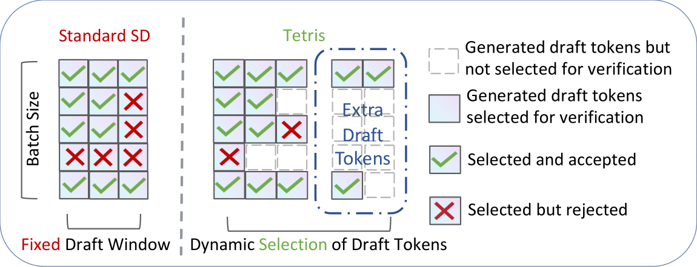

This is the official code for the paper published at ACL 2024 main conference: 
> TETRIS: Optimal Draft Token Selection for Batch Speculative Decoding
> 
> Zhaoxuan Wu, Zijian Zhou, Arun Verma, Alok Prakash, Daniela Rus, and Bryan Kian Hsiang Low

# What's Tetris ?

Tetris optimizes the total throughput of batch speculative decoding in multi-request settings by strategically selecting draft tokens for verification.

⭐ **_Fast LLM inference for service providers with limited inference capacity._**

Unlike existing methods that optimize for a single request or a group of requests as a whole, Tetris actively selects the most promising draft tokens (for every request in a batch) to be accepted when verified in parallel, resulting in fewer rejected tokens and hence less wasted computing resources.
<!-- Such an effective resource utilization to achieve fast inference in large language models (LLMs) is especially important to service providers with limited inference capacity. -->



# Installation

Install the library from source.
```bash
export MAX_JOBS=6
conda install ccache
pip install -e .
```
The build will take a few minutes to complete. If you encounter any problem, please refer to the [vLLM documentation](https://docs.vllm.ai/en/latest/getting_started/installation/gpu/index.html) for a complete guide.

Install the up-to-date FastChat library from source.
```bash
git clone https://github.com/lm-sys/FastChat.git
cd FastChat
pip3 install --upgrade pip
pip3 install -e .
```

# Prepare the data
You can download the dataset by running:

```bash
wget https://huggingface.co/datasets/anon8231489123/ShareGPT_Vicuna_unfiltered/resolve/main/ShareGPT_V3_unfiltered_cleaned_split.json
```

You can get the Arena dataset and the Domain-Specific Tough Questions dataset by running [`convert_datasets.py`](convert_datasets.py):
```bash
python convert_datasets.py
```

# Run our code
The main logic for Tetris is in [`vllm/spec_decode/tetris.py`](vllm/spec_decode/tetris.py).

The configurations for the experiments are in [`benchmarks/dsd/scripts/run_tetris.sh`](benchmarks/dsd/scripts/run_tetris.sh).

To run experiments, execute the following command:
```bash
bash benchmarks/dsd/scripts/run_tetris.sh
```


# Note and acknowledgments
This project builds upon the work of others. 
Our code is a fork from https://github.com/LiuXiaoxuanPKU/vllm.
It contains the original contents from the [vLLM library](https://github.com/vllm-project/vllm), specifically version v0.4.2.
We thank the contributors of the vLLM project and Xiaoxuan Liu for their amazing implementation.